###########################
Overview of MUIO
###########################

Home tab
+++++++++++++

Once the software is installed on your desktop computer, you can open it, and the Home tab will appear. Here, you’ll find a list of all available models. If you are a new user, the only model initially available will be the default one, called CLEWs demo. 

For each model, you have five options:

1.	Description of the model – Provides a general overview of the model.
2.	Configure model – Allows you to modify the model’s structure and parameters.
3.	Backup model – Downloads a copy of the model to your computer.
4.	Copy model – Creates a duplicate of the model.
5.	Delete model – Removes the model from the list.

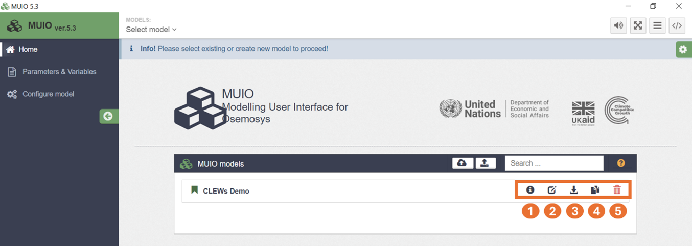
 
In the Home tab, you also have two additional options for uploading models:
1.	Restore model – Allows you to upload a model in the MUIO-specific format, such as those created using the Backup model option described earlier.
2.	Import model – Enables you to upload a model in an Excel-based format (e.g., a CLICSAND file) using otoole. For more information, please visit: `CCG Youtube channel <https://www.youtube.com/watch?v=JrgHWnMDD4M>`_  

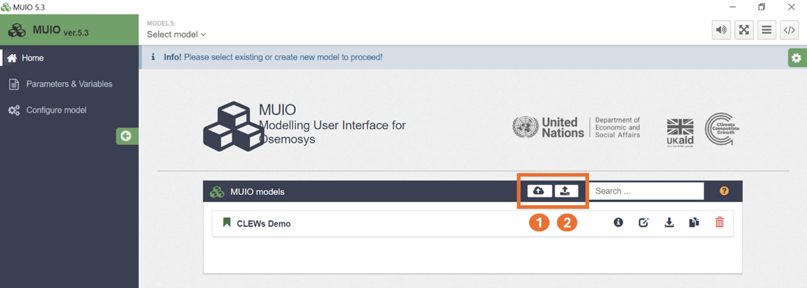

To select a model, either click on its name in the list or use the Select Model option in the top menu bar.

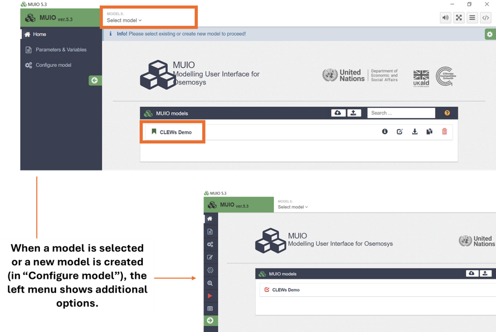

Parameters and variables
+++++++++++++

It displays a list of model parameters and variables, along with their associated sets, default values, and guidance on unit specification. You can update the default values and units as needed to suit the requirements of your modelling work.

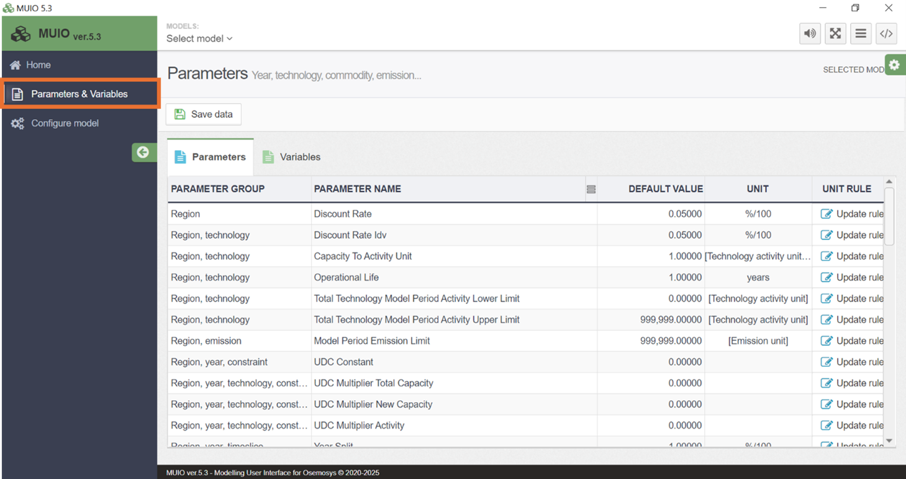
   
Configure model
+++++++++++++

If no model is selected, the Configure model option allows you to create a new one. In this case, simply enter a model name and click Save new model.

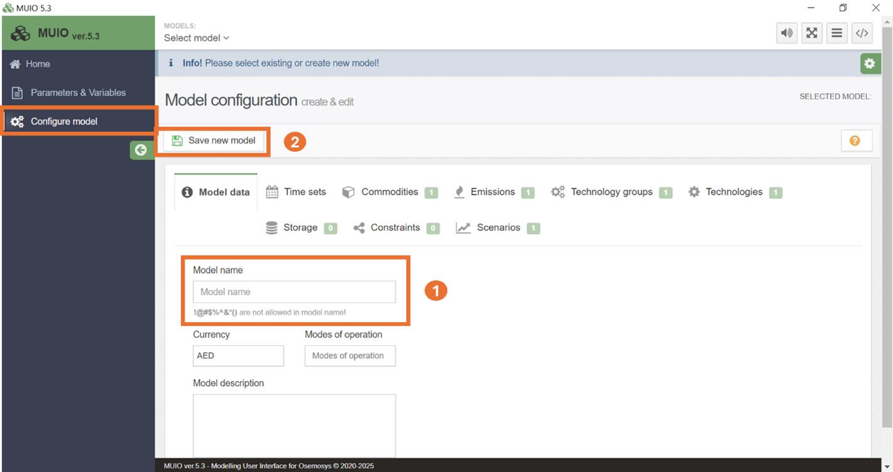

Once a model is created or selected, you can create or edit any of its set components (e.g., timeslices, years, commodities, technologies, etc.). In this module, you will build the structure of your model by navigating through each of the available tabs. There are nine tabs in total that you can modify:

1.	Model Data – Define the number of modes of operation and the currency unit, as well as the name and description of your model.
2.	Time Sets – Define the temporal resolution of your model in terms of years and timeslices. If you are working with storage technologies, you can also create seasons, day types, and daily time brackets.
3.	Commodities – Define the various commodities or fuels used in your model.
4.	Emissions – Define the types of emissions included in your model.
5.	Technology Groups – An optional feature that allows you to categorize technologies.
6.	Technologies – Define the technologies to be included in your model.
7.	Constraints – Define any User-Defined Constraints (UDCs), if applicable.
8.	Scenarios – Set up different scenarios within one model to modify specific parameters for different cases.

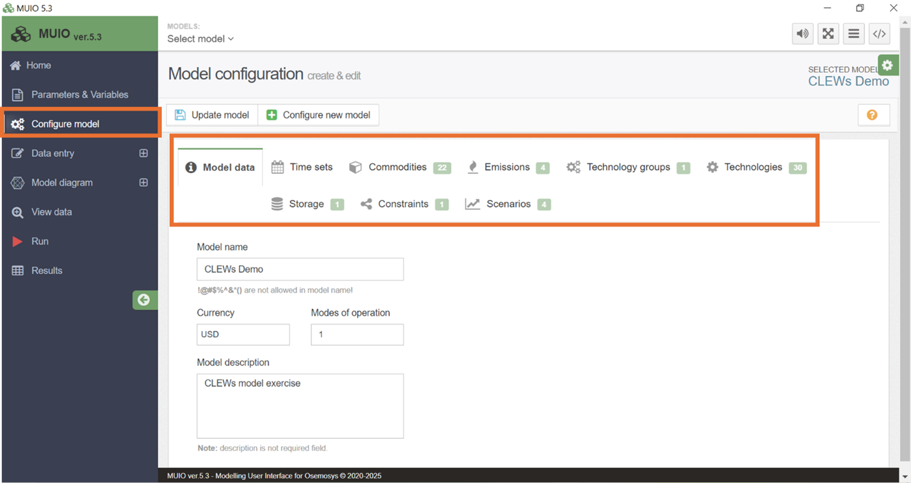

Data entry
+++++++++++++

In this tab, you can enter parameter data. When selected, a list of available parameters is displayed. The search function allows you to quickly filter and locate the desired parameter(s). Once selected, you can input the corresponding data for the chosen parameter. Additionally, options in the upper right corner allow you to save data, adjust the number of decimal places, or export the grid to an Excel file.

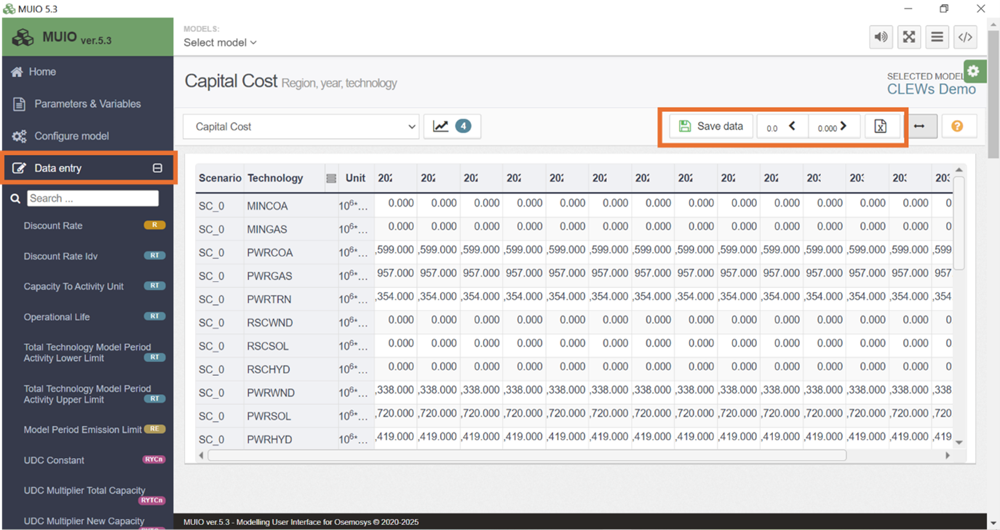

Model diagram
+++++++++++++

Displays the Reference Energy System (RES) represented in the model. Two viewing options are available:

1.	Dynamic – Allows user input to customize what information is displayed and how it is presented.
2.	Simple – A static view showing the RES as boxes and lines.

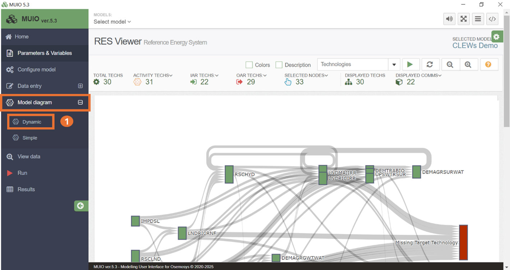

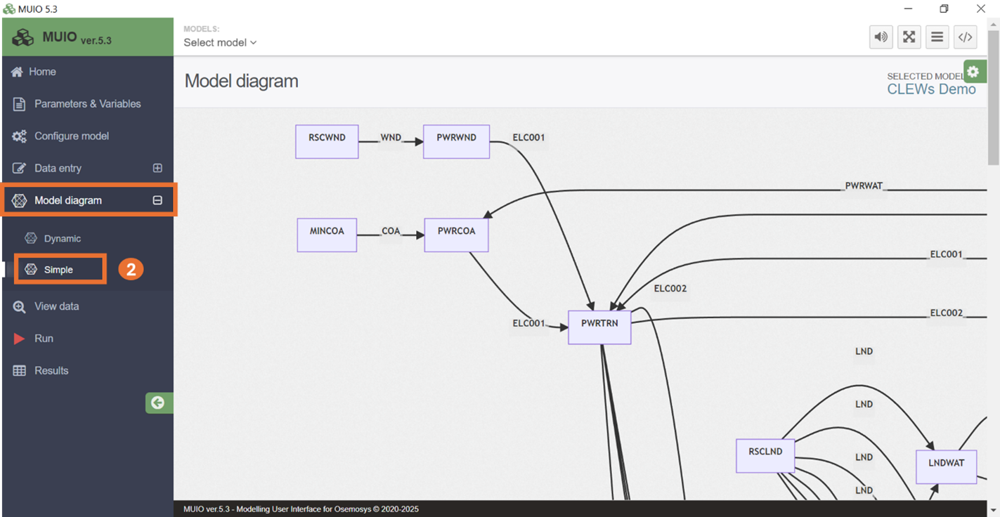

View data
+++++++++++++

This tab enables you to view all parameter data entered for a specific technology, commodity, or emission. It is especially useful for quickly identifying potential data entry errors and for facilitating model debugging.

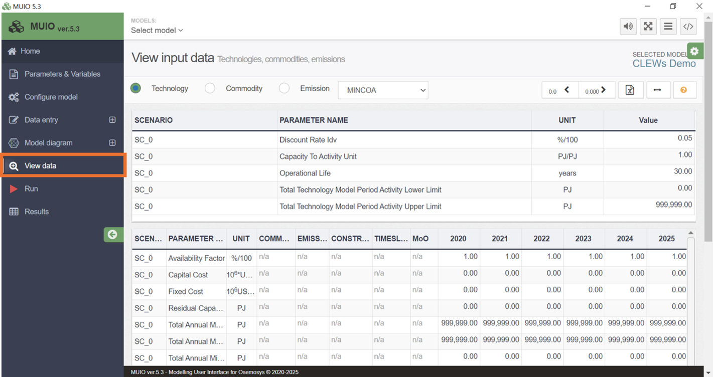

Running a model
+++++++++++++

In the Run tab, you can create a case to execute, which functions as an instance of the model. Within a case, you can select one or more scenarios that represent variations in specific parameters.

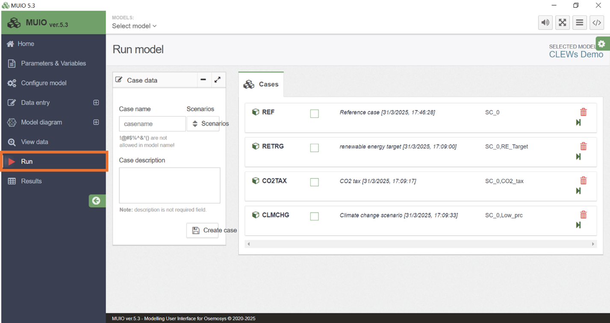

Results visualization
+++++++++++++

In this tab, you can display model results (output variables) for executed cases. Users can customize the chart or table layout, apply filters, and further tailor the results view to their needs using pivot table functionality.

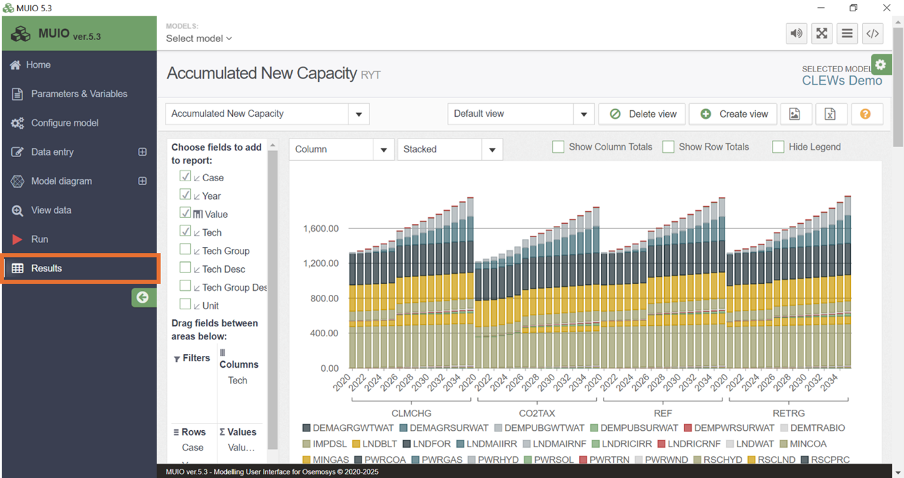